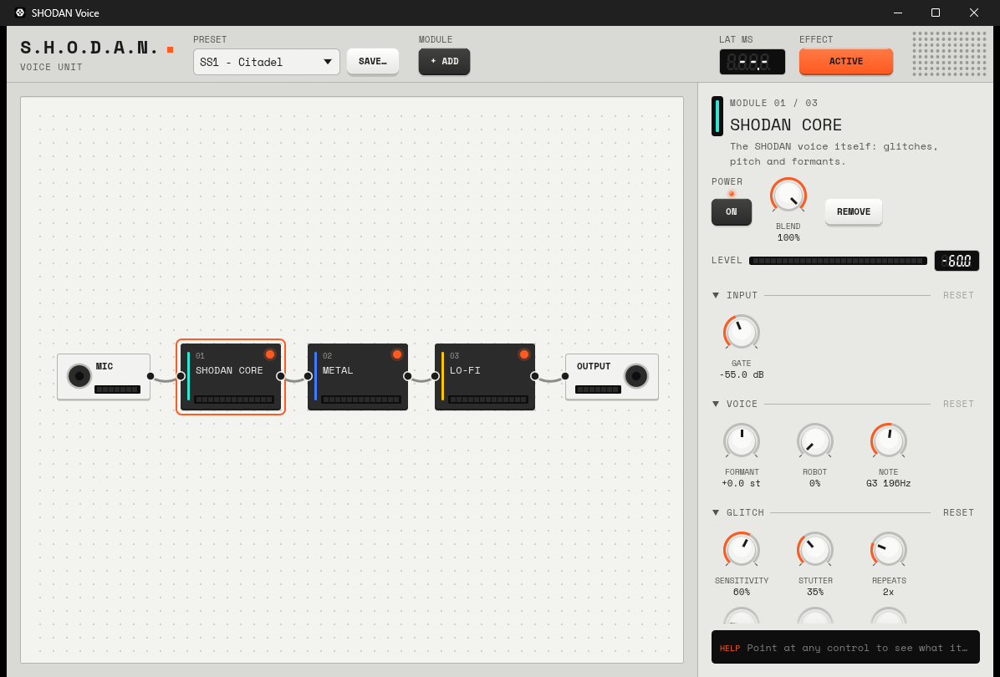

# SHODAN Voice

Turn your microphone into SHODAN, the AI from *System Shock*, live. The voice glitches, stutters, jumps in pitch and layers detuned copies of itself. It comes out on a virtual audio cable, so Discord, OBS or a game can use it as a microphone.



The sound comes from a **patchbay** of modules: MIC → modules → OUTPUT. You can add, reorder and remove modules while you talk:

| Module | What it does |
|---|---|
| **SHODAN Core** | The voice itself. Linear-prediction analysis splits the voice into source and formants. Glitches (stutter, reverse, warp) and pitch moves happen on the source, so the formants stay intelligible. It also has granular pitch shifting, up to four detuned layers, and robot pitch flattening. |
| **Metal** | Flanger. |
| **Lo-fi** | Bit and sample-rate crusher. |
| **TitoBot** | Listens with Whisper and answers in a robot language. Each of its 42 known words ("yes", "no", "hello", "go", "danger", and one to ten…) has its own learnable motif. It recognises words *while you are still talking*: about 25 ms per pass on a GPU. |
| **CLAP plugins** | Any CLAP effect installed on your system, with its own editor window. |

## Using it

- **Add a module:** click **+ ADD**, or click the **⊕** on a cable to insert it at that point.
- **Reorder:** drag a node.
- **More options:** right-click a node.
- **Change settings:** click a node to open its settings in the inspector on the right. MIC and OUTPUT are nodes too; that's where you pick devices.
- **Keys:** `Del` removes the selected module, `Space` switches it on or off, the arrow keys walk the chain, and `Ctrl`+arrows move a module.
- **Presets:** the built-in presets are *SS1 – Citadel*, *SS2 – Von Braun*, *Subtle* and *Glitch Storm*. Your own presets save the whole rack.

To use it as a microphone in other apps, install [VB-Audio Virtual Cable](https://vb-audio.com/Cable/). Set SHODAN's **OUTPUT** to the cable, then pick "CABLE Output" as the mic in Discord or OBS.

## Building

Windows only, Rust stable (MSVC).

```powershell
cargo build --release                                  # everything: CLAP host + Whisper on CUDA
cargo build --release --no-default-features --features clap-host,speech   # Whisper on the CPU (~1 s per utterance)
cargo build --release --no-default-features            # no CLAP host, no speech recognition
```

The default build compiles whisper.cpp with CUDA. It needs cmake, clang and the NVIDIA CUDA toolkit, and the first build takes about five minutes.

TitoBot needs a Whisper model. Download [`ggml-base.en.bin`](https://huggingface.co/ggerganov/whisper.cpp/tree/main) into `%APPDATA%\shodan-voice\config\models\`, or point `SHODAN_WHISPER_MODEL` at a model file.

## Offline render

The same engine runs over a WAV file, deterministically for a given seed. This is handy for comparing DSP changes without a microphone:

```powershell
cargo run --release -- --render samples\input_tts.wav out.wav --preset ss1 --seed 1 --set robot=1
cargo run --release -- --render samples\input_tts.wav out.wav --rack titobot --say "hello yes danger"
```

`--rack id,id,...` picks a chain, `--set key=value` sets any knob (an unknown key lists them all), and `--hear` runs the live Whisper listener over the file.

## License

MIT, see [LICENSE](LICENSE). The embedded Space Mono font is under the SIL Open Font License, see [assets/fonts/OFL.txt](assets/fonts/OFL.txt).
